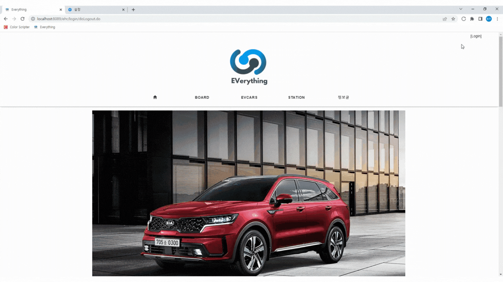
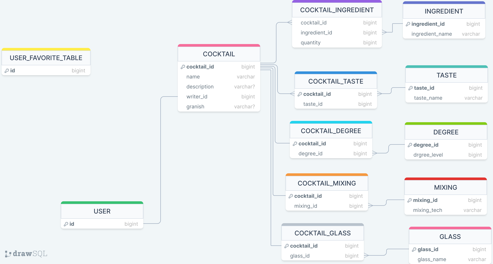
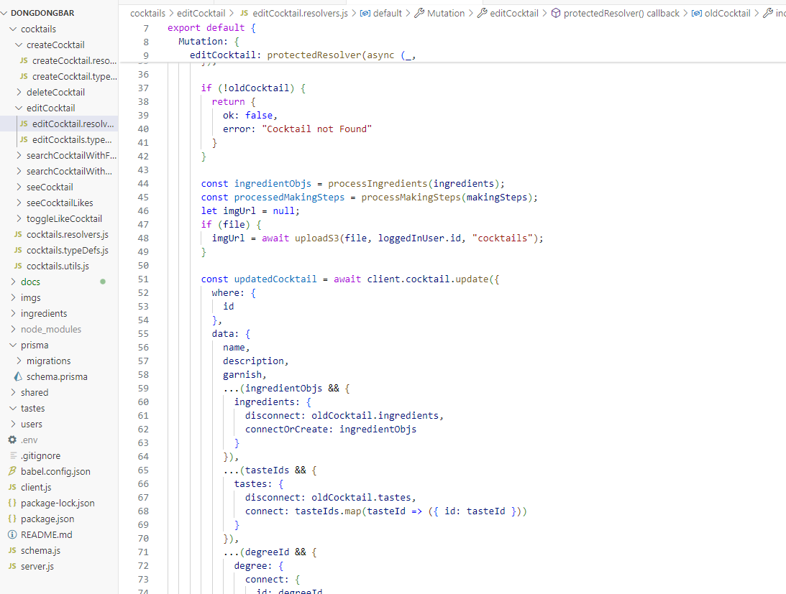
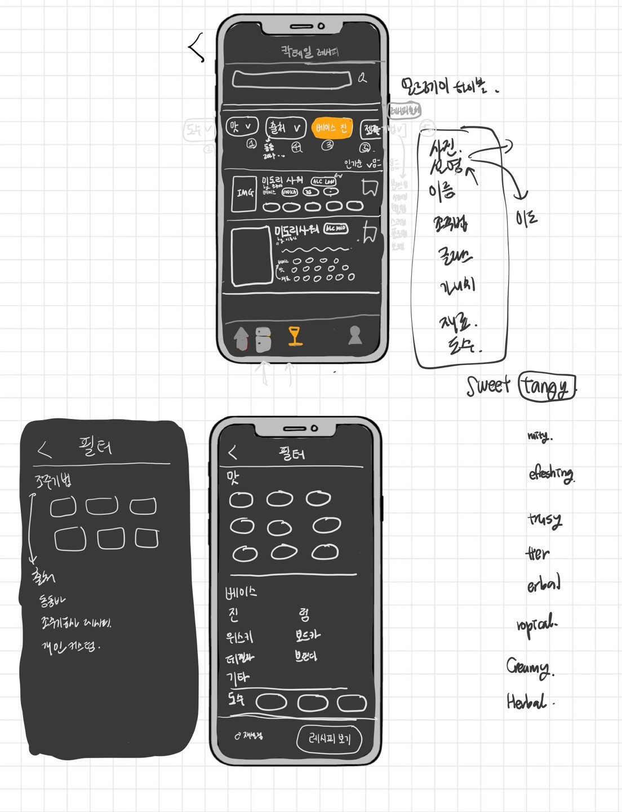

# 김동주 포트폴리오

## 자기 소개

---

서강대학교 수학과( 2017.03 ~ 2024.02) 

서강대학교 수학과를 졸업하고, 개발자에 관심이 있어 공부하고 있는 개발자 지망생입니다.

Java, JavaScript 기반의 BE/FE를 공부하며 C++로 알고리즘 공부도 병행하고 있습니다.

이메일 : rlaehdwn60@gmail.com 전화번호 : 010-3433-2657

## 프로젝트

---
### 웹페이지 개발 프로젝트

기간 : 2022.11 ~ 2022.12

링크 : https://github.com/hykim-king/ELECMUSK

주요 기능입니다.

- 전기차 관련 정보 제공
    - 전기차 보조금, 충전소 위치등을 제공하는 외부 API를 활용하여 관련 정보 제공
- 커뮤니티
    - 회원가입, 로그인등과 커뮤니티 게시판 글 작성 및 열람 기능
- 전기차 관련 블로그, 뉴스 글 가져오기 기능
    - 네이버 검색 API를 활용해 전기차 관련 뉴스, 블로그 글 내용 및 링크 제공

### 칵테일 레시피 관리 어플리케이션 개발 프로젝트

기간 : 2024. 03 ~ 2024. 07

인스타그램에 적용되는 기술 스택을 활용한 어플리케이션 개발

Node.js - ReactJS기반 프로젝트

GraphQL과 이와 관련된 Apollo-server, PrismaORM 사용

칵테일 레시피 관리 어플리케이션 기획 / 개발 (1인)

  

    
    
  

  

    
  

DB설계, 화면 설계, 소스 코드 이미지

주요 기능입니다.

- 유저 관리
    - 회원가입, 유저 정보 변경 등 기본적인 회원 관리 기능
- 칵테일 레시피 CRUD
    - 칵테일 레시피 추가, 불러오기, 수정, 삭제 기능
    - 유저별 칵테일 레시피 소지 및 다른 유저의 레시피 검색 기능
    - 맛, 도수, 재료등 필터를 이용한 검색 기능

## 공부 경험

---

### 풀스택 웹 개발 강의 수강 (2022.07 ~ 2022.12)

신촌 코리아IT 아카데미에서 임베디드 & 웹 융합 응용 SW 개발자 과정(858시간) 수료했고 이수내용은 다음과 같습니다.

[BE]

- JAVA, Spring, RDBMS(Oracle), SQL을 이용한 BE 구성

[FE]

- HTML, JavaScript, CSS를 이용한 웹 페이지 FE 구성

### 우아한테크코스 프리코스 참여 (2023.10 ~ 2023.12)

우아한테크코스에서 4주간의 프리코스를 참여하였고 중요하게 다루었던 내용은 3가지였습니다.

1. 코드 컨벤션 맞춰 작성하기
2. README.md에 구현할 기능 목록 정리및 문서화 후 작성
3. 캡슐화를 통한 읽고 수정하기 쉬운 코드 작성

- 1주차 숫자 야구 게임

[GitHub - ilot12/java-baseball-6 at ilot12](https://github.com/ilot12/java-baseball-6/tree/ilot12)

- 2주차 자동차 경주

[GitHub - ilot12/java-racingcar-6 at ilot12](https://github.com/ilot12/java-racingcar-6/tree/ilot12)

- 3주차 로또

[GitHub - ilot12/java-lotto-6 at ilot12](https://github.com/ilot12/java-lotto-6/tree/ilot12)

- 4주차 크리스마스 프로모션

[GitHub - ilot12/java-christmas-6 at ilot12](https://github.com/ilot12/java-christmas-6-ilot12)

### 웹 / 어플리케이션 BE/FE 공부

Nomad Coder에서 제공하는 인터넷 강의를 통해 BE와 FE를 공부하고 있습니다.

JavaScript기반으로 Node.js를 사용해 GraphQL 백엔드를 만드는 것에 관한 강의입니다.

들었던 강의입니다.

- GraphQL로 영화 API 만들기

[GraphQL로 영화 API 만들기 – 노마드 코더 Nomad Coders](https://nomadcoders.co/graphql-for-beginners)

- GraphQL로 영화 웹 앱 만들기

[GraphQL로 영화 웹 앱 만들기 – 노마드 코더 Nomad Coders](https://nomadcoders.co/react-graphql-for-beginners)

- ReactJS로 영화 웹 서비스 만들기

[ReactJS로 영화 웹 서비스 만들기 – 노마드 코더 Nomad Coders](https://nomadcoders.co/react-for-beginners)

- 인스타그램 클론코딩

[[풀스택] 인스타그램 클론코딩 – 노마드 코더 Nomad Coders](https://nomadcoders.co/instaclone)

### C++로 알고리즘 공부

백준과 프로그래머스를 통해 C++로 알고리즘 공부를 하고 있습니다.

[https://github.com/ilot12/algorithm-practice](https://github.com/ilot12/algorithm-practice)
