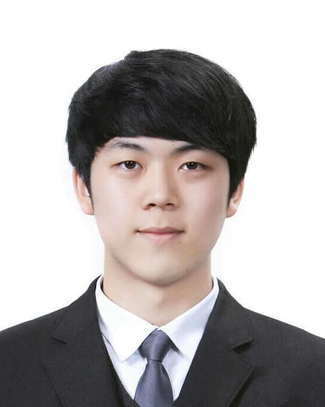
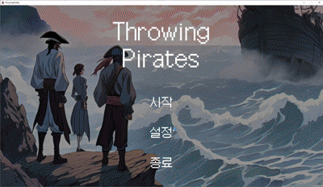
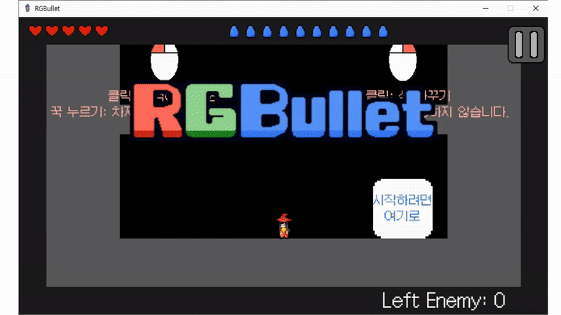
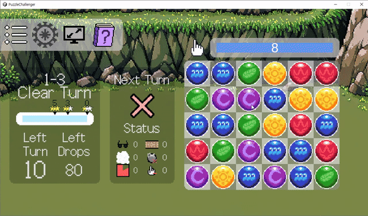
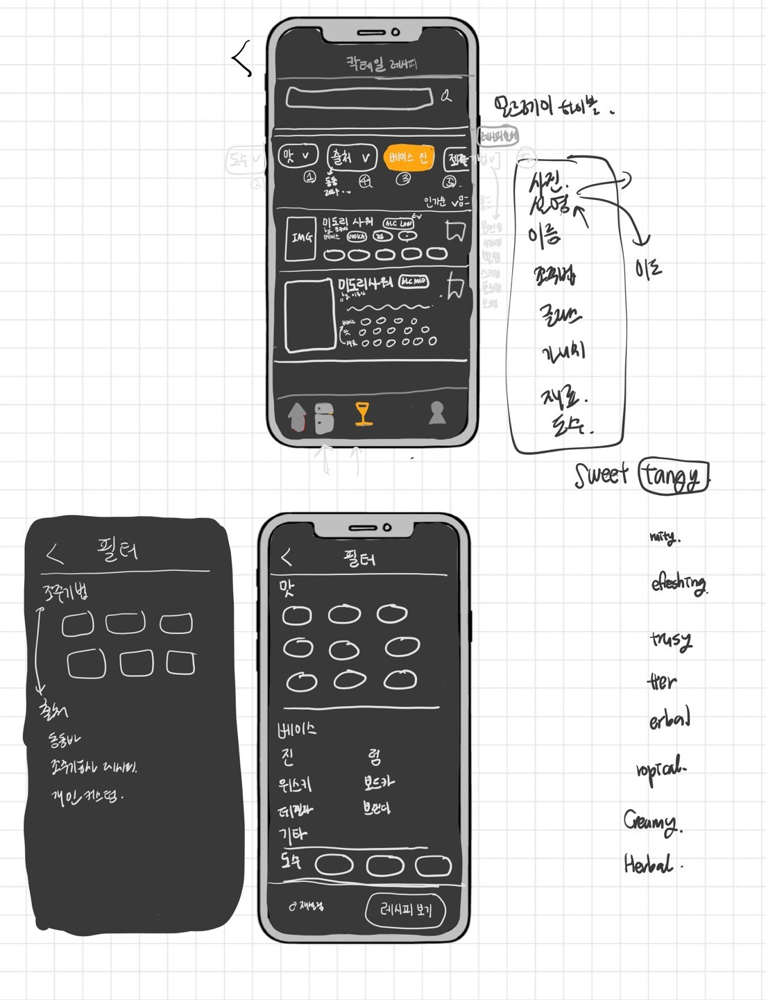
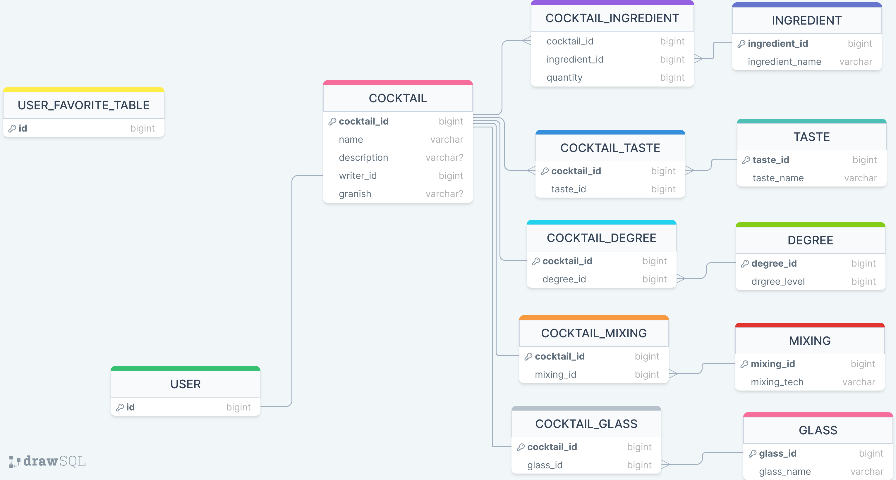
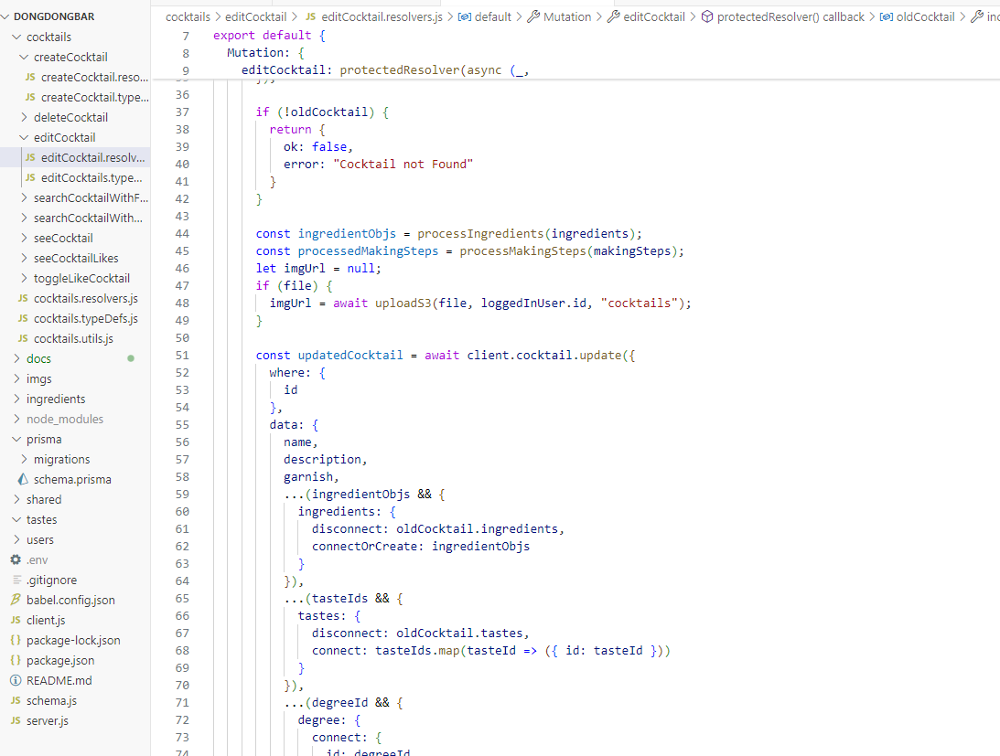
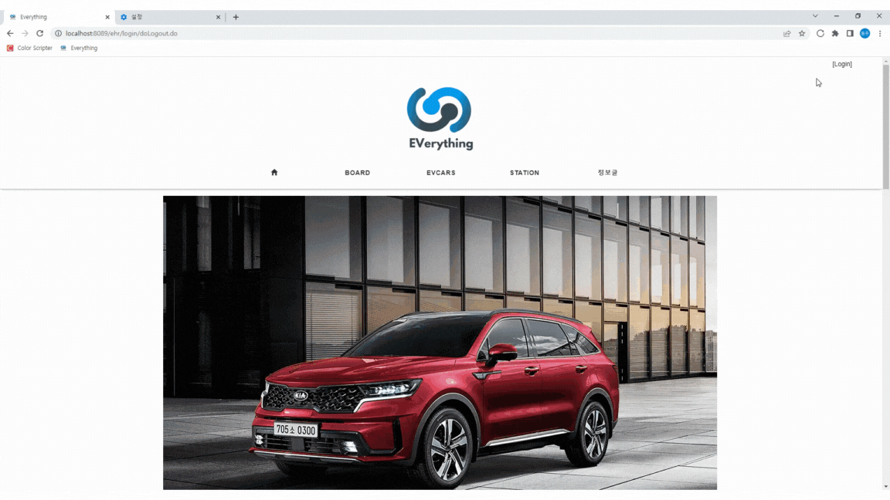

# 김동주 포트폴리오

## 자기 소개

---

서강대학교 수학과( 2017.03 ~ 2024.02) 

서강대학교 수학과를 졸업하고, 개발자에 관심이 있어 공부하고 있는 개발자 지망생입니다.

게임 개발에 관심있고, 유니티를 이용해 공부해서 기획부터 완성까지 1인 프로젝트 및 팀 프로젝트를 진행해 보았습니다.

Java, JavaScript 기반의 BE/FE를 공부하며 C++로 알고리즘 공부도 병행하고 있습니다.

이메일 : rlaehdwn60@gmail.com 전화번호 : 010-3433-2657

## 프로젝트

---
### 게임 개발 팀 프로젝트

기간 : 2025. 01 ~ 2025. 02

슬레이 더 스파이어와 모바일 게임 Weapon Throwing Rpg에서 영감을 받아 제작했습니다.

슬레이 더 스파이어와 똑같이 진행되고, 동작도 카드를 이용하여 똑같이 동작되도록 구현했습니다.

자연스러운 카드 움직임을 위해 슬레이 더 스파이어, 하스스톤을 비롯한 여러 카드게임을 참고했습니다.

손패에 쥔 것처럼 일부가 화면에 잠긴 채 부채꼴 모양으로 카드를 쥐고, 선택한 카드를 크게하여 강조하고, 다른 카드가 가려지지 않도록 조금 비켜주는 등
자연스럽게 카드를 사용하는 것 처럼 보이기 위한 다른 게임의 기술들을 확인하고, 적용했습니다.

로그라이크 카드 게임을 구현하기 위해 Scriptable Object와 많은 Enum을 활용해

여러가지 동작을 하는 카드들을 쉽게 추가하고 동작하도록 만들었습니다.

또한 핵심 기믹인 라인별로 무기끼리 연산하는 Weapon Throwing Rpg에서 얻은 아이디어를 구현하기 위해
카드의 사용 및 연산의 구조를 나누어 적용되도록 구현했습니다.

협업은 Unity클라우드에서 제공하는 DevOps를 활용했습니다.(Plastic SCM)

각자 브랜치를 나누어 따로 작업하고 팀장인 제가 코드 및 구조 리뷰를 하며 머지하는 식으로 협업했습니다.

서로의 코드를 읽고 구조에 대한 회의를 하고 개선하는 식으로 진행해서 서로의 스크립트를 공유하며 협업했고, 원만하게 진행했습니다.

제가 맡은 부분은 카드 데이터, 카드 움직임, 카드 사용, 전투 연산으로 게임이 돌아가는 핵심 기믹을 구현했습니다.

그래픽은 일부 에셋을 활용하고 특정 픽셀아트는 제가 직접 그려 활용했습니다.

	
### 게임 개발 개인 프로젝트

기간 : 2024. 12 (2주)

모바일 게임 ReversEstory에서 영감을 받아 제작했습니다.

PC에서 마우스로 조작하여 RGB라는 기믹을 활용해 로그라이크 탄막 액션 플랫포머입니다.

로그라이크게임을 위한 현재 게임의 데이터 관리와 추가 스탯을 얻는 기능을 구현했습니다.

또 랜덤으로 맵과 스테이지가 생성되는 방식을 구현했습니다.

핵심 기믹인 RGB를 구현하기 위해 충돌시 태그를 활용하여 처리했습니다.

보스가 랜덤으로 선택된 행동을 정해진 시간마다 반복하도록 코루틴을 활용했습니다.

	
### 게임 개발 개인 프로젝트

기간 : 2024. 11 (1주)

링크 : https://github.com/ilot12/PuzzleChallenger

모바일 게임 "퍼즐앤드래곤"의 조작, 기믹을 유니티를 이용해 PC에서 동작하도록 구현했습니다.

수집형 RPG가 아닌 스테이지를 깨는 식으로 진행되도록 구현했으며

게임속 기믹(암흑, 구름, 띠, 룰렛)을 모두 구현해보았고

유니티 내장 기능인 사용자의 Input처리, JSON을 이용한 데이터 처리, PlayerPref를 이용한 데이터 내보내기/불러오기, Collider를 통한 충돌 처리
Animatior를 이용해 자연스러운 움직임 등을 구현했습니다.

Aseprite를 활용해 원하는 이미지를 직접 제작했고 배경 외 모든 픽셀아트도 만들며 1인 개발을 경험했습니다.
	

### 칵테일 레시피 관리 어플리케이션 개발 프로젝트

기간 : 2024. 03 ~ 2024. 07

인스타그램에 적용되는 기술 스택을 활용한 어플리케이션 개발

Node.js - ReactJS기반 프로젝트

GraphQL과 이와 관련된 Apollo-server, PrismaORM 사용

칵테일 레시피 관리 어플리케이션 기획 / 개발 (1인)

  <table style="width:100%; border:none;">
    <tr>
      <td style="width:50%; border:none;" rowspan="2"></td>
      <td style="width:50%; border:none;"></td>
    </tr>
    <tr>
      <td style="width:50%; border:none;"></td>
    </tr>
  </table>

DB설계, 화면 설계, 소스 코드 이미지

주요 기능입니다.

- 유저 관리
    - 회원가입, 유저 정보 변경 등 기본적인 회원 관리 기능
- 칵테일 레시피 CRUD
    - 칵테일 레시피 추가, 불러오기, 수정, 삭제 기능
    - 유저별 칵테일 레시피 소지 및 다른 유저의 레시피 검색 기능
    - 맛, 도수, 재료등 필터를 이용한 검색 기능

### 웹페이지 개발 프로젝트

기간 : 2022.11 ~ 2022.12

링크 : https://github.com/hykim-king/ELECMUSK

주요 기능입니다.

- 전기차 관련 정보 제공
    - 전기차 보조금, 충전소 위치등을 제공하는 외부 API를 활용하여 관련 정보 제공
- 커뮤니티
    - 회원가입, 로그인등과 커뮤니티 게시판 글 작성 및 열람 기능
- 전기차 관련 블로그, 뉴스 글 가져오기 기능
    - 네이버 검색 API를 활용해 전기차 관련 뉴스, 블로그 글 내용 및 링크 제공
	
	
## 공부 경험

---

### 멋쟁이사자처럼 유니티 부트캠프 (2024. 07 ~ 2025. 03)

멋쟁이사자처럼에서 제공하는 6개월의 유니티 기반 게임 개발과정에 참여했습니다.

게임 기획부터, 개발, 개발에 필요한 에셋 활용 등 전 과정을 배우고
이를 활용해 원하는 게임을 기획하고 만들어 보기까지 전부 경험할 수 있는 수업입니다.
2개의 개인 프로젝트와 2개의 팀 프로젝트를 진행했습니다.

주요 내용은
C#기초, 유니티 내장 기능 활용, 디자인 패턴, 네트워크 및 유니티 제공 API활용입니다.

### 웹 / 어플리케이션 BE/FE 공부 (2024. 01 ~ 2024. 07)

Nomad Coder에서 제공하는 인터넷 강의를 통해 BE와 FE를 공부하고 있습니다.

JavaScript기반으로 Node.js를 사용해 GraphQL 백엔드를 만드는 것에 관한 강의입니다.

들었던 강의입니다.

- GraphQL로 영화 API 만들기

[GraphQL로 영화 API 만들기 – 노마드 코더 Nomad Coders](https://nomadcoders.co/graphql-for-beginners)

- GraphQL로 영화 웹 앱 만들기

[GraphQL로 영화 웹 앱 만들기 – 노마드 코더 Nomad Coders](https://nomadcoders.co/react-graphql-for-beginners)

- ReactJS로 영화 웹 서비스 만들기

[ReactJS로 영화 웹 서비스 만들기 – 노마드 코더 Nomad Coders](https://nomadcoders.co/react-for-beginners)

- 인스타그램 클론코딩

[[풀스택] 인스타그램 클론코딩 – 노마드 코더 Nomad Coders](https://nomadcoders.co/instaclone)

### C++로 알고리즘 공부

백준과 프로그래머스를 통해 C++로 알고리즘 공부를 하고 있습니다.

[https://github.com/ilot12/algorithm-practice](https://github.com/ilot12/algorithm-practice)

### 우아한테크코스 프리코스 참여 (2023.10 ~ 2023.12)

우아한테크코스에서 4주간의 프리코스를 참여하였고 중요하게 다루었던 내용은 3가지였습니다.

1. 코드 컨벤션 맞춰 작성하기
2. README.md에 구현할 기능 목록 정리및 문서화 후 작성
3. 캡슐화를 통한 읽고 수정하기 쉬운 코드 작성

- 1주차 숫자 야구 게임

[GitHub - ilot12/java-baseball-6 at ilot12](https://github.com/ilot12/java-baseball-6/tree/ilot12)

- 2주차 자동차 경주

[GitHub - ilot12/java-racingcar-6 at ilot12](https://github.com/ilot12/java-racingcar-6/tree/ilot12)

- 3주차 로또

[GitHub - ilot12/java-lotto-6 at ilot12](https://github.com/ilot12/java-lotto-6/tree/ilot12)

- 4주차 크리스마스 프로모션

[GitHub - ilot12/java-christmas-6 at ilot12](https://github.com/ilot12/java-christmas-6-ilot12)

### 풀스택 웹 개발 강의 수강 (2022.07 ~ 2022.12)

신촌 코리아IT 아카데미에서 임베디드 & 웹 융합 응용 SW 개발자 과정(858시간) 수료했고 이수내용은 다음과 같습니다.

[BE]

- JAVA, Spring, RDBMS(Oracle), SQL을 이용한 BE 구성

[FE]

- HTML, JavaScript, CSS를 이용한 웹 페이지 FE 구성

